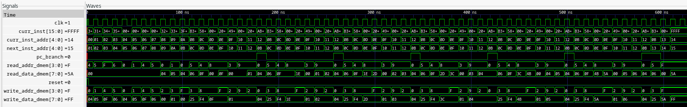

1) iverilog -g2012 src/testbench.sv src/top.sv src/common/*.sv -o sim.vvp
2) vvp sim.vvp
3) Examine sim.vcd file using GTKWave

> Waveform of a simple program that calculates rf[rf[0]] * rf[rf[1]] using add instruction in a loop and stores in dm[15] 

